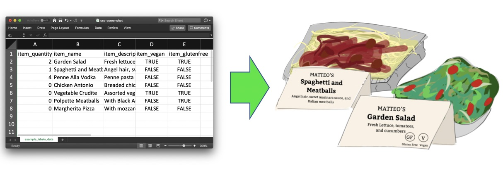

# Festa

Festa generates catering labels from a CSV spreadsheet of items.



## Create catering labels

To start, create a spreadsheet with column names: `item_quantity`, `item_name`, `item_description`, `item_vegan`, `item_glutenfree`. Specify the number of labels to generate with `item_quantity`. Save the spreadsheet as a CSV.

Next, create a TXT file and save the text to be generated on the back of all of the labels. This can be multi-line.

Clone this repository in command line:

```
git clone https://github.com/dasmer/festa.git
cd festa
```
Then copy and paste your CSV data file and the back of label TXT file to the newly cloned `festa` folder. Before running the python script, make sure you have [Beautiful Soup][1] installed. Next, run:
```
python festa.py "[RESTAURANT-TITLE]" [CSV-MENU-NAME].csv [BACK-TEXT-NAME].txt [OUTPUT-LABELS-HTML-NAME].html
```
where
`[RESTAURANT-TITLE]` The name of the restaurant. This goes on top of the item name on each label.
`[CSV-MENU-NAME]` is name of your CSV file in this folder.
`[BACK-TEXT-NAME]` This is the name of the TXT file that has text for the back of the label.
`[OUTPUT-LABELS-HTML-NAME]` will be the name of the output HTML file.

Your HTML labels have been generated.
Open `[OUTPUT-LABELS-HTML-NAME]` in a Chrome browser.
Print (or save to PDF). Make sure to set margins to 0 in Chrome's print settings.

## Example

To run the example, type the following in command line:

```
python festa.py "Matteo's" example/labels_data.csv example/back_text.txt matteos_labels.html
```

Open the generated `matteos_labels.html` in Chrome to print the example catering labels. 


## Contributing

I would thrill to see the repository extended to support additional functionality. Pull requests are welcome :octocat:.
